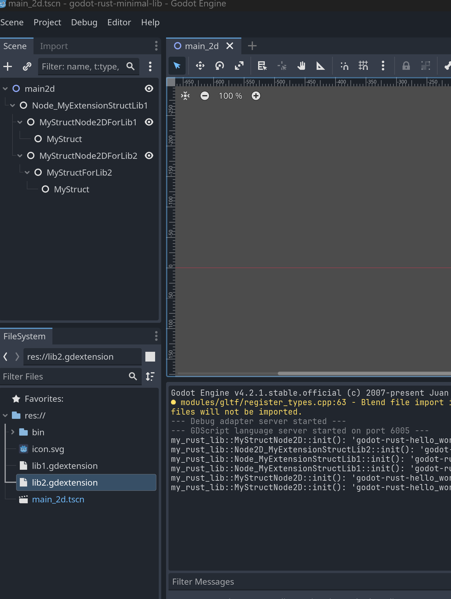

# godot421-rust-minimal-lib-setup

Firstly, if you're just looking for a quick way to get a project started that binds godot-rust, just use [scaffold-godot-rust][1].  This project was created mainly because I was looking for others while I was troubleshooting why I wasn't getting my extensions to show up on Godot editor, and I could not find anything that was using v4.2 with latest GDExtension method (most were just using the old 3.x method).

This is a sample project setup for Linux+Windows on Godot 4.2.1 with godot-rust with 2 libs (lib1 and lib2) deriving Node2D and NodeSprite2D, each calling '\_init()' and '\_ready()'

Original intentions were first to get at least 2 rust libraries to be interacting with Godot; mainly because I could not stand this dynamic variants of GDScript when I was implementing an 2D Array[Array[]] of homogeneous dimensions, and due to unstrict types, I'd sometimes place a row of (the array is row-ordered)ref instead of actual array that was constructed to be added because append() (or was it insert()) can append a new row-set as ref when all other rows are actualy Array[Object], and during runtime, it'll just (implicitly?) dynamic cast that ref of Array[Object] as Array[Object] in which, because it failed dynamic casting, returns null... good grief! Perhaps back when I was on C++/C# days, it was perfectly fine to think like that...

Simpler explanation of the above, if the array tells me that it's length()/size() is N, and I iterate though it N times, I EXPECT ALL N-elements in the array to be non-NULL/nullptr instances (nor should I have to dynamically cast each elements)!  But due to the flexibility of the language that allows variant types to be part of an array, I have to waste my time dynamically casting it and then testing whether it is null or not.

From a Rust (or even F#) programmer's point of view, that makes us cringe!  In any case, these days, I prefer compilers (more specifically, static-analyser in realtime as I type, such as rust-analyzer and Iodine (F#)) to catch the bugs for me during my "thinking" while implementing (coding), rather than after completion of implemenatations, guessing what typo I've made wrong during debugging/running/testing...

P/S: Obviously, on a memory-tight machines (I'd imagine people who chooses Godot really like small memory footprints), these memory-hogging static-analysers (i.e. Ionide on console vim eats up sometimes 1 or 2GB of my RAM!), it's is not too favored (though previously, I've felt that c-tags were actually slowing me down, but I don't use them anymore, so I don't know how much of an impact they actually have on my workflow).

Few (opinionated) notes:

- If you are attempting to implement 'lib.rs' to just do very simple things, don't bother, and use '.gd' GDScript instead. It's just a waste of time compiling and debugging/runtime-testing/verifying

[1]: https://github.com/byteatatime/scaffold-godot-rust

## Technical Notes

- Platform: This boilerplate was only tested on Windows 11 due to my Debian desktop went south...
- Version: Godot v4.2.1 (though on .gdextension, you MUST set it to "4.2" (without the ".1" patch version) or else it'll complain that it cannot find your extension - bug on upstream?)
- Cargo: the github "master" version (see Cargo.toml) of [godot-rust (extension)][1]
- Each crates can only define ONE [entry-point][2] (i.e. in 'lib.rs'); but as long as multiple modules ('mod') you create are private to Godot, you can have as many 'mod' as you'd want
  - In C/C++ speaks, think of it as when you'd create a shared object (.so and/or .dll), you'd normally only have one single 'main()' as an entry point (well, you don't really need to define main() in shared object, but you get the point, just need to declare entry point).
- Crates which you've written that are shared between multiple libraries (i.e. lib1 and lib2) does not have to necessarily have GDExtension; Think of these to be just private library not exposed/shared to Godot
- The 'lib1' and 'lib2' are just examples of 2 libs that are interacting with Godot, and each has its own 'lib.rs' in which it's sole purpose is to expose entry-points for each crates, but will try to clearly write the examples in a way which each libs will have multiple modules that are not exposed to Godot, as well as a shared crate which does not have an entry-point exposed to Godot

Directory structures are:

```bash
    + lib1/
      + src/
        + lib.rs
        + my_module.rs
    + lib2/
      + src/
        + lib.rs
        + my_module.rs
    + shared_internal_lib/
      + src/
        + lib.rs
        + my_module.rs
    + build.sh
```

Note that 'build.sh' is a BASH script, so if trying to run it in Windows, make sure to open up MinGW BASH terminal (i.e. windows-git).

Node structure:

```bash
  + Node2D_main
    + Node_lib1
    + Node2D_lib2
```

- Node2D_main - main.tscn
- Node_lib1 - lib1.gdextension
- Node_lib2 - lib2.gdextension



Originally, I wanted to create Node_lib1 to be TileMap but I thought it would just make this sample more complicated than it is, so I went with generic do-nothing Node instead (same with Node2D_lib2)

You can possibly, write a GDScript in which parent (Node2D_main) can pass data down to each children (Node_lib1 and Node2D_lib2), or trigger signals to each children, etc.  You can also modify each rust "scripts" to query for sibling nodes (via paths or name?) and call its methods (not recommended, for it causes undesired coupling, rather follow the pattern in which you'd expose a method for parent to call and pass down data or emit-signal (pub/sub) pattern), etc.

Note to self: it used to be that Boost signals was very inefficient and expensive (note that that was like back in C++11 days), mainly because it had to deal with how to check/test if subscribers went out-of-scope or if publisher disappered, etc.  Possibly should look at the C++ side of how signals are implemented in Godot to see if it's efficient.

- [1]: https://github.com/godot-rust/gdext
- [2]: https://godot-rust.github.io/docs/gdext/master/godot/prelude/trait.ExtensionLibrary.html

## Goals

- clear examples of 2 libs in which each libs (crates) will exponse one-and-only-one GDExtension entry-point
- clear examples of 1 (private) library which 2 libs will call/utilize, in which it is private and no entry-point is exposed for GDExtension to reference
- bare minimum code and interfaces but as much commenting as possible

## Post-mortem/what I've learned so far

### It's a script, not an application

Do NOT forget that each rust source code, or at least, the main 'lib.rs' file in which the entry points are exposed, are SCRIPT (GDScript) pattern.  I have this hard-to-let-go habbit of implementing RAII-pattern in which I usually do:

```rust
impl MyStruct {
  pub fn new(...) -> Self{
    ...
  }
  ...
}
```

 But the issue with this, is that your script has its own Init() and Ready() functions, and if your script "HasA" MyStruct, only place you should be calling MyStruct::new() is in Init().  But then, if MyStruct "HasA" Godot INode derived object (i.e. MyNodeX:Node2D), you then get into this bind of wondering when to call Node2D::Init() and how...  In a nutshell, just remind yourself that in GDScript, you never (or rarely?) had to call it's children's Init() (i.e. TileMap has TileSet as it's internal children in which by the time you access the TileMap GDScript, the TileSets are all instantiated/concrete).  Overall, just keep constantly reminding yourself that "I'm writing a script".

I still even now, have this temptations to create a Struct that HasA Godot Object rather than searching the node-tree for its children on a IsA Godot Objects.  When one originally began learning GDScript, we had the practice to add a node, and then add a child(ren) node(s) below the node; In which if the parent (or siblings) needed to query/access the other nodes (parent, children, or siblings), we did get_node().

In practice, a Struct can have (HasA) any Godot primites, but cannot own/contain (HasA) instance of a node.  You can, however, scan in Ready() (or post-Ready()) methods for nodes and hold a reference of that node (unsure if that adds refcount of that node?).

All-in-all, write your Rust code as if it was/is a "script", NOT as an app or a "program".  Perhaps the practice should be always to start as GDScript, and when you detect it'll get complicated, translate whatever GDScript you've started into Rust, and go from there.

### Minimal version support

If you are trying to implement a GDExtension, you MUST set the "version" field in the "*.gdextension" file(s) to "4.2" (without the ".1" patch version) or else it'll complain that it cannot find your extension - bug on upstream?

### Write kernels

Unless you're writing the shared library logic (i.e. singleton pattern with Autoload, etc), constantly remind self that you're writing a "script" for each callback actions and signals.  Which means you MUST (or WANT to) keep the logic as simple and quick as possible; i.e. Imagine 1000 enemies visible on the viewport, in which they call your Process() function that takes 1mSec each (per enemy).  That means 1000 mSec (1 second) per frame is spent causing almost impossible to play due to heinous framerate!  Simply put, these Scripts are similar to "kernel" (as in, GPGPU coding) logics, which you'd want to make sure to have it process as quickly as possible and bail/opt-out early.

### Public and Private

Any modules declared in 'mod.rs' should be private from Godot visibility, and only thing that should be exposed/public/visible to Godot is what you've declared as entry-points in 'lib.rs'.

### No need to add that kitchen sink

If you are trying to implement 'lib.rs' to just do very simple things, don't bother, and use '.gd' GDScript instead. It's just a waste of time compiling and debugging/runtime-testing/verifying.

In a nutshell, unless I really need the type-strictness of Rust in which it WILL save me time (and less bugs) to have static-analyzers catch my mistakes, I'd just use GDScript instead.

Also, you get the bonus of Intellisense/code-completions using Godot (IDE) Editor as well as quickly (via visually) acquire the knowledge of hierarchies and dependencies (yes, of course, you can view all that while adding your rust GDExtension libraries to the node/scene tree, but the advantages is that you never have to leave the IDE).

IMHO, I think it's silly to write an extension in Rust just to set the velocity and rotation of the player, when it's much easier to quickly spot/understand/debug it if it remained as a GDScript (but as a tutorial, it is perfectly valid, because it gave purpose of what it is accomplishing).

As mentioned elsewhere, I think it's a good idea to only rely on Rust for the more complex/time-consuming/hard-to-debug logic that are not dependant on dynamic type-casting, and for the simple/fast/easy-to-debug logic.  All in all, if I do not have to deal with containers (Array and/or Dictionary, see below), I'd probably stick with GDScript rather than Rust extension.

### Container class (Array and Dictionary)

I personally am not too used to the kitchen-sink Array implementations of GDScript where it's a mashup of different types of collections.  Though I appreciate the "in" functionality in the "for" loop:

```godot
for tileset in tilemap.tilesets:
  ...
```

All this mashup of an Array class being able to insert() (I'm used to array only being able to append - i.e. myArray.append(some_more_array)) as well as being able to push_front() and push_back(), where I only expect Queue and Vector containers to be allowed of such methods, etc, it just confuses me that it does so many things...

I do also appreciate the Dictionary container, but I'm still making guesses on GDScript when I try to insert a duplicate key, whether it will replace it (implicitly and silently, also known as upsert()) with new key (F# and Rust way), or fail/throw-exception (C# and I think JSON way, throws key-already-exists kind of exception due to probably indexing like database key).  In most cases, I'll usually just stick with Rust if I have to deal with HashMap/Dictionary...

```rust
use std::collections::HashMap;

fn main() {
    let mut map = HashMap::new();
    map.insert("key1", "value1");
    map.insert("key2", "value2");
    map.insert("key2", "value3 overriding value2"); // unlike C#, in Rust will upsert() instead of runtime exception throwing like C#; note that even Rust-Clippy will not warn me about this...
    for kvp in map {
        print!("{:?}", kvp);
    }
}
// Output:
// ("key1", "value1")("key2", "value3 overriding value2")
```
